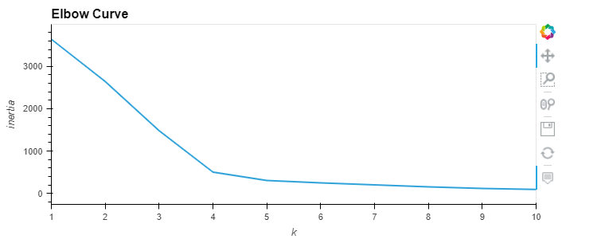
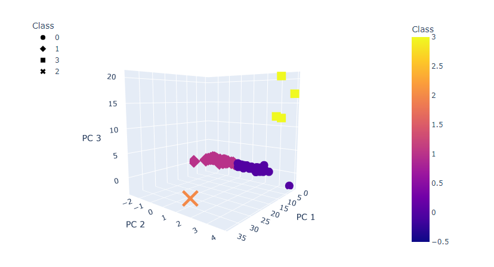

# Cryptocurrencies_Analysis

## Overview of Cryptocurrencies Analysis

### Purpose
The purpose for this project was to help our friend Martha in her pitch to her firm Accountability Accounting for investing in cryptocurrencies. With the amount of different cryptocurrency options available on the market and an available dataset on cryptocurrency, the goal was to determine trends from the various cryptocurrencies. It was decided that unsupervised machine learning would be the best tool to assist with analyzing the dataset. Specifically, the company has requested a report that includes what cryptocurrencies are on the trading marker and how they could be grouped to create a classification system for the new investment. 

## Cryptocurrencies Results

### Unsupervised ML Clustering Performance
The data was first preprocessed in order to ready the dataset to perform the Principal Component Analysis which reduces the number of dimensions to help speed up the clustering algorithm. After the PCA was applied to create the three principal components, an elbow curve plot was created. This plot helped determine the ideal number of clusters to use for a K-means cluster algorithm, which was 4 as shown below. 

The K-means model was then applied with the 4 clusters to the dataframe created from the Principal Component Analysis to create the clusters for each of the cleaned cryptocurrencies. A Class column was created from the K-means algorithm predictions and added to the dataframe. The results showed that there were 532 tradable cryptocurrencies from the original dataset. The below 3D-Scatter plot shows a breakdown between each class of the 4 clusters. 

